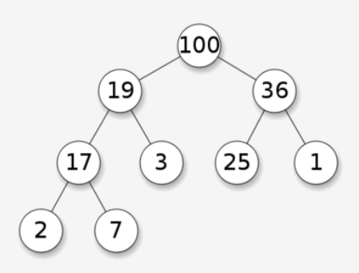
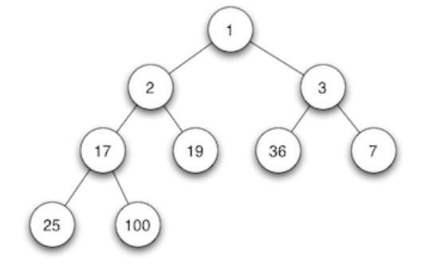
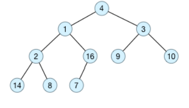
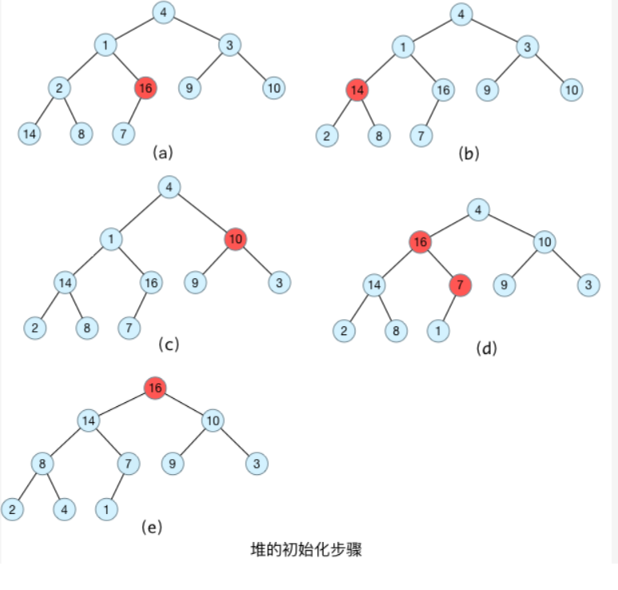

## 最大堆与最小堆

### 一、堆树的定义

堆树的定义：

- 堆树是一颗完全二叉树；
- 堆树中某个节点的值总是不大于或者不小于其孩子节点的值；
- 堆树中每个节点的子树都是堆树；

当父节点的键值大于或等于任何一个子节点的键值时为最大堆。

当父节点的键值小于或等于任何一个子节点的键值时为最小堆。

### 二、堆树的操作

以最大堆为例，最小堆同理。

原始数据为a[] = {4, 1, 3, 2, 16, 9, 10, 14, 8, 7}，采用顺序存储方式，对应的完全二叉树如下图所示：

#### 1.构造最大堆

在构造堆的基本思想就是：首先将每个叶子节点视为一个堆，再将每个叶子节点与其父节点一起构造成一个包含更多节点的对。

所以，在构造堆的时候，首先需要找到最后一个节点的父节点，从这个节点开始构造最大堆；直到该节点前面所有分支节点都处理完毕，这样最大堆就构造完毕了。

假设树的节点个数为n，以1为下标开始编号，直到n结束。对于节点i，其父节点为i/2；左孩子节点为i*2，右孩子节点为i*2+1。最后一个节点的下标为n，其父节点的下标为n/2。

如下图所示，最后一个节点为7，其父节点为16，从16这个节点开始构造最大堆；构造完毕之后，转移到下一个父节点2，直到所有父节点都构造完毕。

> **上面构造最大堆的时候，从底而上，一层一层地不断基于父节点构造最大堆，直至到达根节点完成整个最大堆的构造**